# Análise COVID-19 - RJ

## Descrição

Este projeto é um aplicativo Java desenvolvido para auxiliar os gestores da Secretaria de Saúde do Rio de Janeiro na análise da evolução da contaminação pela COVID-19 em vários bairros da cidade. O programa realiza a leitura de um arquivo contendo dados de casos de COVID-19, calcula estatísticas relevantes, identifica bairros impactados e permite a adição de novos registros.

## Funcionalidades

- **Leitura de Dados**: Lê um arquivo contendo informações de casos de COVID-19 nos bairros.
- **Cálculo de Estatísticas**: Calcula a taxa de crescimento e a taxa de letalidade para cada bairro.
- **Identificação de Bairros Impactados**: Identifica os bairros com maior taxa de crescimento e maior taxa de letalidade.
- **Adição de Registros**: Permite a inclusão de novos registros no arquivo de dados.
- **Interface Gráfica**: Utiliza Java Swing para uma interface gráfica amigável com scroll e largura flexível.

## Estrutura do Projeto

- **Bairro**: Representa um bairro com informações sobre casos e óbitos.
- **FileManager**: Manipula a leitura e escrita dos dados no arquivo.
- **CovidDataProcessor**: Processa e calcula estatísticas dos dados.
- **Menu**: Gerencia a interface gráfica e interação do usuário.
- **Main**: Ponto de entrada do programa que inicializa o aplicativo.

## Diagrama de Classes

```mermaid
classDiagram
    class Bairro {
        -String nome
        -int casosConfirmados
        -int obitos
        -LocalDate data
        +double calcularTaxaLetalidade()
        +double calcularTaxaCrescimento(int casosAnteriores)
    }

    class FileManager {
        +List~Bairro~ lerArquivo(String caminho)
        +void escreverNoArquivo(String caminho, Bairro bairro)
    }

    class CovidDataProcessor {
        +Bairro calcularMaiorTaxaCrescimento(List~Bairro~ bairros)
        +Bairro calcularMaiorTaxaLetalidade(List~Bairro~ bairros)
    }

    class Menu {
        -FileManager fileManager
        -CovidDataProcessor dataProcessor
        -String caminhoArquivo
        +Menu(FileManager fileManager, CovidDataProcessor dataProcessor, String caminhoArquivo)
        +void exibirEstatisticas()
        +void adicionarNovoRegistro()
    }

    class Main {
        +void main(String[] args)
    }

    Menu --> FileManager : usa
    Menu --> CovidDataProcessor : usa
    CovidDataProcessor --> Bairro : usa
    FileManager --> Bairro : manipula
    Main --> Menu : inicializa
```



## Requisitos

- JDK 11 ou superior

## Como Executar

1. Compile o projeto:
    ```bash
    javac -d bin src/**/*.java
    ```

2. Execute o programa:
    ```bash
    java -cp bin br.gov.rj.saude.covid.Main <caminho do arquivo>
    ```

   Substitua `<caminho do arquivo>` pelo caminho para o arquivo contendo os dados de COVID-19.

## Formato do Arquivo de Dados

O arquivo deve seguir o formato:
```
Nome do Bairro,Casos Confirmados,Óbitos,Data (yyyy-mm-dd)
```

Exemplo:
```
Copacabana,1200,100,2023-08-01
Ipanema,800,50,2023-08-01
Leblon,950,75,2023-08-01
Santa Teresa,300,15,2023-08-01
```

## Capturas de Tela

### Tela de Estatísticas


### Adicionar Novo Registro


## Contribuição

Sinta-se à vontade para contribuir com melhorias ou correções. Para isso, por favor, faça um fork do projeto, crie uma branch para sua feature ou correção e envie um pull request.

## Licença

Este projeto está licenciado sob a [Licença MIT](LICENSE).

## Contato

Para dúvidas ou sugestões, entre em contato com [Claudio Cassimiro](mailto:claudioletras2019@gmail.com).